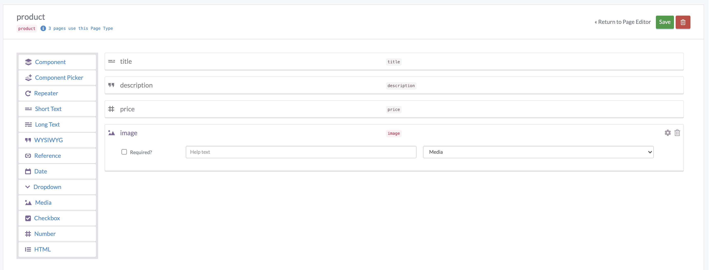
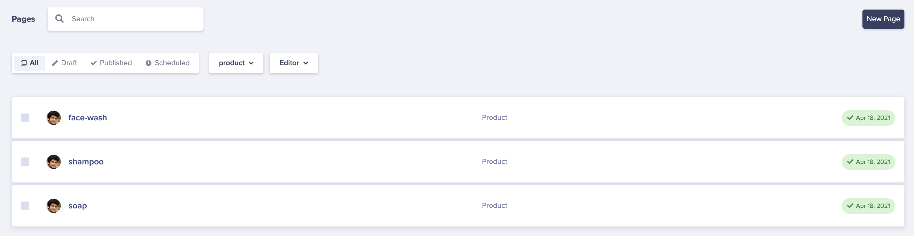
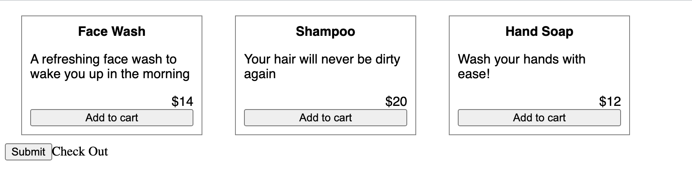
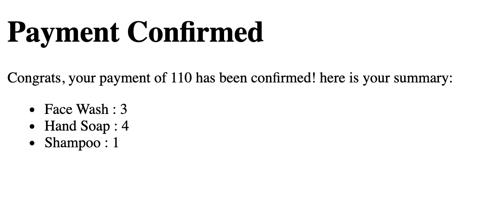
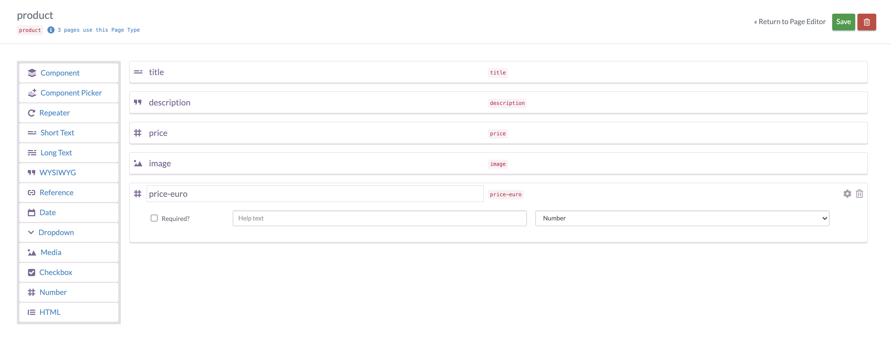
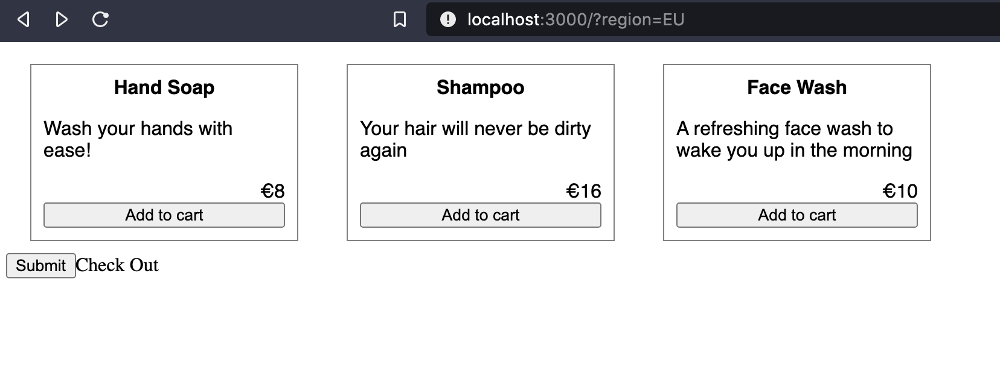

# Node.js Ecommerce: How To Build a Shopping App with ButterCMS

In this tutorial, we'll learn how to build a NodeJS Ecommerce application using ButterCMS, and some popular open source libraries. We will be focussing on the NodeJS server, while providing a basic web interface for the frontend application.

We will learn how to implement some of the most common parts of a NodeJS Ecommerce application, such as:

1. **Cart** - The collection of items that the user has selected to buy later.
2. **Product catalog** - The overall collection of items that the store has available for the user to buy.
3. **Checkout** - The processing page that appears after the user has decided to purchase all the items in their cart.

## Setting Up Our Environment

Let's bootstrap the code for our application by creating a new application directory, and initializing an npm project. I've named it `buttercms-nodejs-ecommerce` :

```
mkdir buttercms-nodejs-ecommerce
cd buttercms-nodejs-ecommerce
npm init
```

Next, we need to install some libraries in order to make our application work:

```
npm i buttercms express body-parser ejs
```

Each of these libraries serves a different purpose in our application:

1. `buttercms` is used to interact with the ButterCMS API
2. [`express`](https://expressjs.com/) is the library used to implement the HTTP server and its routes.
3. `body-parser` and `ejs` are libraries used by express to parse JSON request bodies, and render templated HTML pages, respectively.

We can create a new file called `server.js` with the following code:

```js
// import the required external libraries
const express = require("express")
const { json } = require("body-parser")
const Butter = require("buttercms")

const { addToCart, getCartItems } = require("./store")

// initialize your butterCMS instance
const butter = Butter("<token>")

// initialize the express application
const app = express()
app.use(json())
// this serves all files in the `public` directory
// and can be used to serve our HTML website
app.use(express.static("public"))
// this renders all "ejs" pages within the `views` directory
app.set("view engine", "ejs")

const port = 3000

// our application can have multiple users, but for now, let's assume there's a single user
// who has this user name
const userName = "sample user"

// start an express server on the given port
app.listen(port, () => {
	console.log(`Example app listening at http://localhost:${port}`)
})
```

This starts an empty server without any HTTP routes.

## Creating Product Catalog on ButterCMS

In enable our NodeJS Ecommerce application, we'll need a way to store and retrieve products.

Let's create a pge template first. We can create a new page type called "product" on the ButterCMS portal, and add the `title`, `description` and `price` fields:



Next, we can add some sample products. I've added some here that will be used in the coming examples:



## Fetching Items from ButterCMS

Let's create a server route to fetch products via the ButterCMS API, and return their details as a response:

```js
app.get("/products", (req, res) => {
	// get all product page types from the ButterCMS portal
	butter.page
		.list("product")
		.then((resp) => {
			// if successful, return the products in the response
			res.json(resp.data)
		})
		// return an internal server error if the call failed
		.catch((err) => res.status(500).send(err))
})
```

In order to display our product catalog, let's create a webpage. We can create a new `index.html` file within the `public` directory:

```html
<!DOCTYPE html>
<html lang="en">
<head>
    <meta charset="UTF-8">
    <meta http-equiv="X-UA-Compatible" content="IE=edge">
    <meta name="viewport" content="width=device-width, initial-scale=1.0">
    <link rel="stylesheet" href="style.css">
    <title>Ecommerce Site</title>
</head>
<body>
    <!-- this will hold the product information -->
    <div class="product-catalog">
    </div>
    <!-- this will allow the user to checkout their selection by calling a POST request to the /checkout endpoint -->
    <form action="/checkout" method="post">
      <input type="submit"  id="check-out">Check Out</button>
    </form>
    <!-- the jQuery library will help us with DOM operations -->
    <script
    src="https://code.jquery.com/jquery-3.6.0.slim.min.js"
    integrity="sha256-u7e5khyithlIdTpu22PHhENmPcRdFiHRjhAuHcs05RI="
    crossorigin="anonymous"></script>
    <script src="script.js"></script>
</body>
</html>
```

We can fetch and render the items from our javascript code in `public/script.js`:

```js
// create a new class to hold the logic of our products actions
class Product {
	constructor(data) {
		this.data = data
		this.quantity = 0
	}

	html() {
		// get the fields from the product data
		const { title, description, price } = this.data.fields

		// create the section that will display the overall quantity
		// and "add to cart" button
		this.quantityHTML = $("<span></span>")
		const addToCart = $("<button>Add to cart</button>").click(
			// the `addToCart` method has to be implemented
			this.addToCart.bind(this)
		)
		addToCart.append(this.quantityHTML)

		// create the HTML template of the product
		const elem = $(`<div class="product">
        <div class="title">${title}</div>
        <div class="description">${description}</div>
        <div class="price">$${price}</div>
    	</div>`).append(addToCart)
		// the addToCart section is appended to each product at the end

		return elem
	}
}

// call the products endpoint we just created
fetch("/products")
	.then((res) => res.json())
	.then((data) => {
		// if successful, loop through each item and append it's
		// HTML output to the product catalog div
		data.data.forEach((item) => {
			const product = new Product(item)
			$(".product-catalog").append(product.html())
		})
	})
	.catch((err) => console.error(err))
```

We can also add some CSS to format the layout and appearance:

```css
.product-catalog {
	display: flex;
}

.product {
	display: flex;
	flex-direction: column;
	width: 200px;
	margin: 10px 20px;
	padding: 10px;
	border: 1px solid gray;
	font-family: sans-serif;
}

.title {
	text-align: center;
	font-weight: bold;
}

.price {
	text-align: right;
}
```

This should give you a fairly basic looking product page:



## Adding Items to the Cart

So far, we have the buttons to add items to our cart under each product. Let's now implement it in our code.

First, we'll create a new file called `store.js` that will be responsible for storing and retirieving items in each users cart:

```js
// create a persistent object to hold cart data
// in production, this data would probably be held in a database
const userCarts = {}

const addToCart = (userId, itemId) => {
	// if a users cart doesn't exist, create an empty cart
	if (!userCarts[userId]) {
		userCarts[userId] = {}
	}

	// if the given item doesn't exist in the cart, create a new entry
	// for it
	if (!userCarts[userId][itemId]) {
		userCarts[userId][itemId] = 0
	}

	// increase the item quantity by one
	userCarts[userId][itemId] += 1
}

// if the users cart exists, return it, or else return an empty object
const getCartItems = (userId) => userCarts[userId] || {}

// export the above methods
module.exports = { addToCart, getCartItems }
```

Next, we'll create a new route that can be called every time an item is added to the cart:

```js
// import the required methods from the store
const { addToCart, getCartItems } = require("./store")

//...

app.post("/cart", (req, res) => {
	// get the item id from the request and add it to the cart
	addToCart(userName, req.body.itemId)
	res.end()
})
```

Now, in `public/script.js` we can add a method to the `Product` class to call this route when the user adds an item to cart:

```js
class Product {
	//...

	addToCart() {
		// send a post request to the /cart endpoint, with the items
		// name as its ID
		fetch("/cart", {
			body: JSON.stringify({ itemId: this.data.name }),
			method: "POST",
			headers: {
				"Content-Type": "application/json",
			},
		})
			.then(() => {
				// if we get a successful response, increase the items quantity
				// in the webpage
				this.quantity++
				this.quantityHTML.text(` (${this.quantity})`)
			})
			.catch((err) => console.error(err))
	}

	//...
}
```

Now everytime a user adds an item to their cart, it is saved in our server as well. This will be useful during checkout.

## Checkout

We already have a form to call the `/checkout` endpoint in the `public/index.html` file:

```html
<form action="/checkout" method="post">
    <input type="submit"  id="check-out">Check Out</button>
</form>
```

Now, let's implement the server route in the `server.js` file:

```js
app.post("/checkout", (req, res) => {
	// get items from the users cart
	const items = getCartItems(userName)

	// create a list of requests to retrieve product information for each item.
	const requests = Object.keys(items).map((key) =>
		butter.page.retrieve("product", key)
	)

	// initialize total to 0
	let total = 0

	// execute all requests simultaneously using Promise.all
	Promise.all(requests)
		.then((responses) => {
			// once all the info is retrieved, add to the total
			// using the product price and quantity
			const renderItems = responses.map((resp) => {
				const { price, title } = resp.data.data.fields
				const quantity = items[resp.data.data.name]
				total += price * quantity

				// the quantity and title are returned and stored in the
				// renderItems variable
				return {
					quantity,
					title,
				}
			})

			// we render the "payment-confirmation" ejs template, by providing
			// the total and the items as template variables
			res.render("payment-confirmation", {
				total,
				items: renderItems,
			})
		})
		// return an internal server error if the API returns an error
		.catch((err) => {
			console.log(err)
			res.status(500).end()
		})
})
```

The code above renders a `"payment-confirmation"` page if the API executes successfully. By default, the [ejs library](https://ejs.co/) will look for `views/payment-confirmation.ejs` and render it if it exists.

Let's create this page now:

```html
<!DOCTYPE html>
<html lang="en">
	<head>
		<meta charset="UTF-8" />
		<meta http-equiv="X-UA-Compatible" content="IE=edge" />
		<meta name="viewport" content="width=device-width, initial-scale=1.0" />
		<title>Document</title>
	</head>
	<body>
		<h1>Payment Confirmed</h1>
		<!-- render the total payment here -->
		<p>
			Congrats, your payment of <%= total %> has been confirmed! here is
			your summary:
		</p>
		<ul>
			<!-- loop through each item and render its name and quantity a list item -->
			<% items.forEach(function(item) { %>
			<li><%= item.title %> : <%= item.quantity %></li>
			<% }); %>
		</ul>
	</body>
</html>
```

This will now render as an HTML page with the template variables filled in:



You may have noticed that we re-fetch the price for every item in the cart to come up with the total amount, instead of letting the user provide it. This is because we want to prevent a malicious user from altering the prices in the client request itself. by fetching the price from the server, we can be sure to come up with the genuine total price.

## Currency and Localization

If you want to add support for multiple regions and currencies, we need to make some changes to both our server, webpage, and the ButterCMS portal.

We've edited the page schema to add support for the euro currency:



Now we can set different values based on the items price in the US and EU regions.

Let's make changes to the `public/index.html` page to add the region info on the checkout form:

```html
<form action="/checkout" method="post">
	<input type="submit" id="check-out">Check Out</button>
	<input type="hidden" name="region" value="US" id="form-region">
</form>
```

Let's make changes to the `public/script.js` file to get the region from the query params, and change the currency accordingly:

```js
// this describes the field to fetch based on the region
const regionPrice = {
	US: "price",
	EU: "price-euro",
}

// this describes the currency unit per region
const regionCurrency = {
	US: "$",
	EU: "€",
}

// we can get the region from the query params
const queryString = window.location.search
const urlParams = new URLSearchParams(queryString)
const region = urlParams.get("region") || "US"

// we append a hidden field to the checkout form to let
// the server know about the region
$("#form-region").attr("value", region)

//...

// we make changes to the Product classes `html()` method
class Product {
	//...

	html() {
		//...

		// we render the currency unit and price based on the region
		const elem = $(`<div class="product">
        <div class="title">${title}</div>
        <div class="description">${description}</div>
        <div class="price">${regionCurrency[region]}${price}</div>
    	</div>`).append(addToCart)

		//...
	}
}
```

Finally, we can make the required changes to the checkout API in the `server.js` file:

```js
// enable the server to decode HTML urlencoded form bodies
const { json, urlencoded } = require("body-parser")

//...

// add url encoding middleware to the body
app.use(urlencoded({ extended: true }))

const regionPrice = {
	US: "price",
	EU: "price-euro",
}

app.post("/checkout", (req, res) => {
	// get the region from the request body
	const { region } = req.body
	//...

	// execute all requests simultaneously using Promise.all
	Promise.all(requests).then((responses) => {
		const renderItems = responses.map((resp) => {
			const { title } = resp.data.data.fields
			// get the price based on the region and add to total
			const price = resp.data.data.fields[regionPrice[region]]
			const quantity = items[resp.data.data.name]
			total += price * quantity

			//...
		})

		//...
	})
	// ...
})
```

Now when we run the server and go to [http://localhost:3000](http://localhost:3000), we can see the prices as usual, but if we navigate to [http://localhost:3000?region=EU](http://localhost:3000?region=EU), we'll start to see the prices and checkout in Euros instead:



## Wrapping Up

So far, we've covered all of the major aspects of building a NodeJS Ecommerce application. We can even extend its functionality further by adding additional behavior, such as:

1. Session management for users, which would help store and retrieve the cart for multiple users based on their authentication credentials.
2. Storing cart information in a persistent database or cache, so that cart information is retained even if the server restarts.
3. Integrating with an external payment portal, like Stripe or Paypal to retrieve payments before showing the payment confirmation page.

Although this tutorial covered the basics, there's a lot more to learn! You can visit the [ButterCMS documentation page](https://buttercms.com/docs/api-client/nodejs) to know what else you can do using the NodeJS API.

You can view the source code for he application [here](https://github.com/sohamkamani/buttercms-nodejs-ecommerce).
